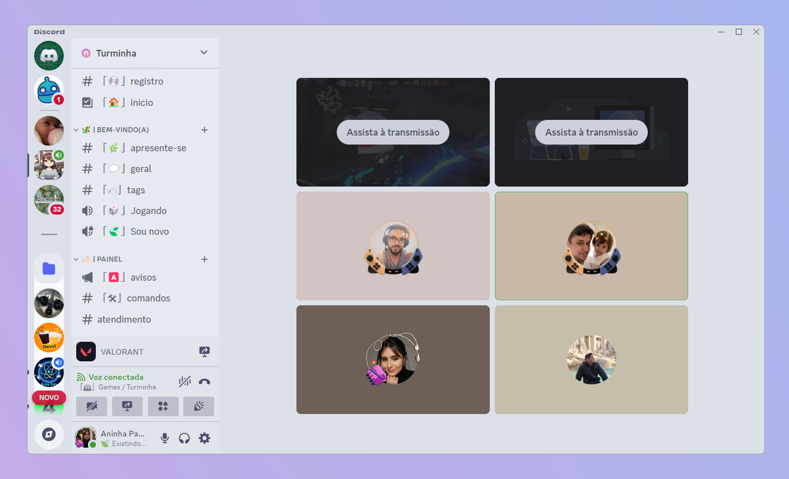
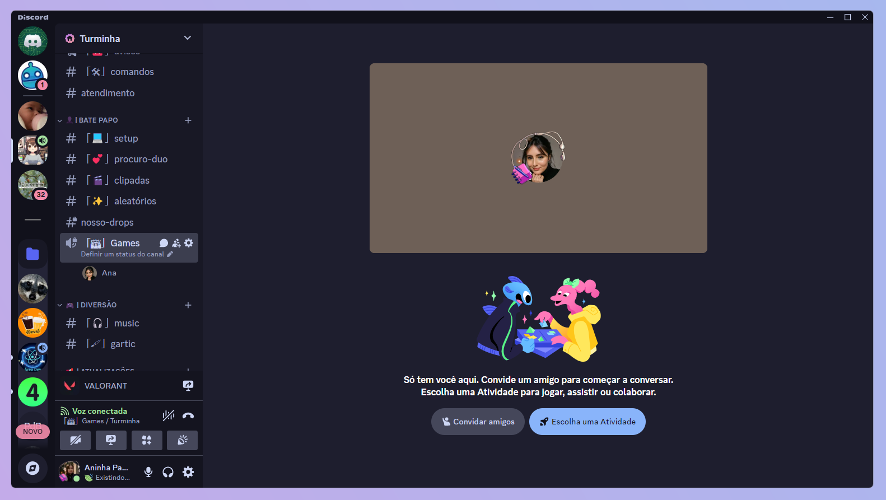
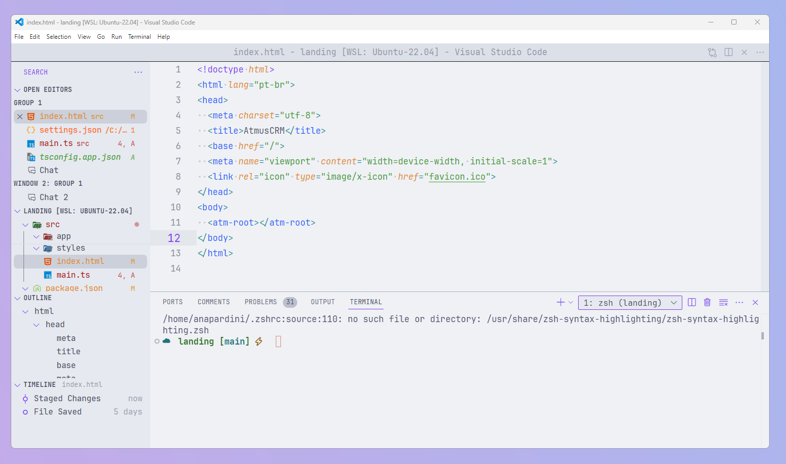
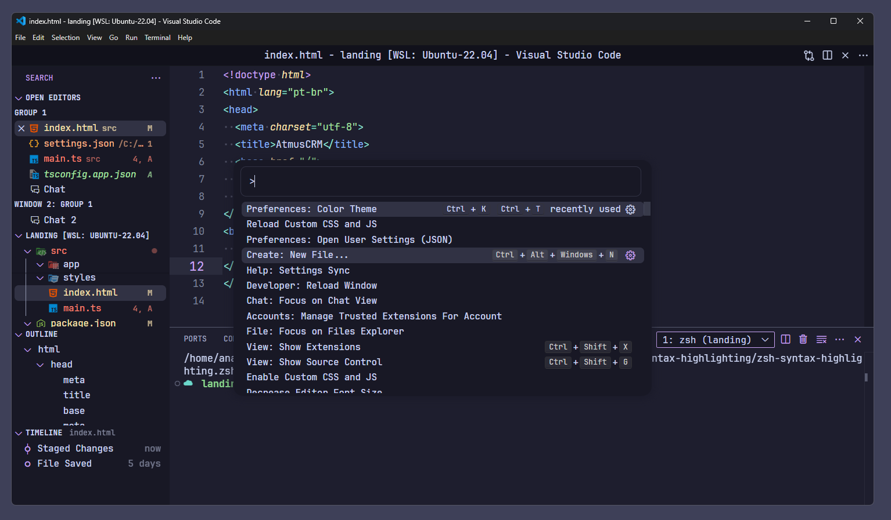
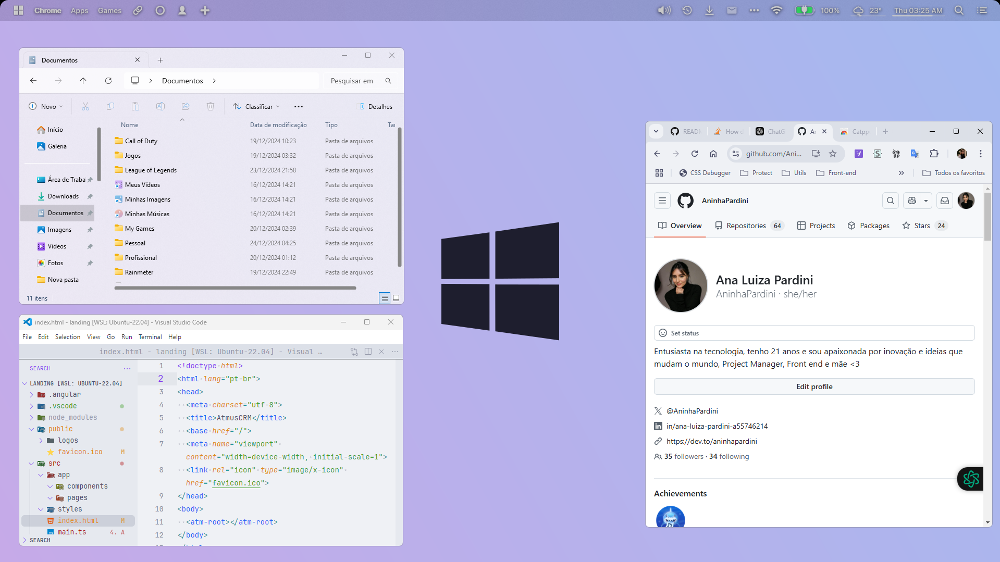
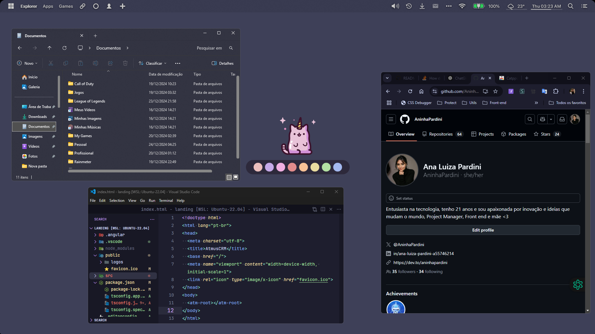

# ✨ Welcome to my Custom Themes for Windows ecossystem! 🖌️
This is my local where I centralize all my custom themes, includes VS Code, Discord, Windows...

# Discord
You can find my theme and instructions inside [Discord Theme](https://github.com/AninhaPardini/CustomThemes/tree/Discord)

# VS Code
My settingsand instructions file stay inside [VS Code Configs](https://github.com/AninhaPardini/CustomThemes/tree/VS-Code), and I use Custom CSS and JS extension to complement styles configs.

# Windows
I use rainmeter + dropfour 4 + Mica for Everyone to change my styles, wallpaper that I use you can find in wallpapers folder in [Windows Configs](https://github.com/AninhaPardini/CustomThemes/tree/Windows).

